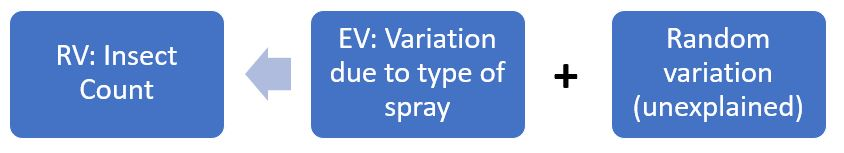

# The Means and Effects Models {#meanseffects}

```{r echo = F, warning = F, message = F}
library(ggplot2)
library(dplyr)
library(flair)
```

## ANOVA Bookkeeping {#bookkeep}

In Part \@ref(intro) we mentioned ANOVA is a way to keep track of the variation in a response variable. Figure \@ref(fig:flowchart) provides a schematic for how we can think about this for our `InsectSprays` data set example introduced in Part \@ref(basics).

```{r flowchart, fig.cap='Conceptual diagram for variation accounting in the insecticide example.', out.width='80%', fig.asp=.75, fig.align='center', echo = F}

```

In 1-way ANOVA we partition the total variation in our response variable **(SS Total)** into two parts- variation due to treatment **(SS Treatment)** and the random error left over **(SS Error)**, viz [@kutner2005]., 

$$SS_{total} =  SS_{trt} + SS_{error} = \sum_{i,j} (y_{ij} - \overline{y}_{..})^2$$
$$ SS_{trt} = \sum_{i,j} (\overline{y}_{i.} - \overline{y}_{..})^2 $$
$$ SS_{error} = \sum_{i,j} (y_{ij} - \overline{y}_{i.})^2 $$

Don't be intimidated by the formulas above. Basically, all we are saying is that we can decompose the total deviation from the overall mean response into two components:

1. The deviation of each treatment group mean from the grand mean of the response variable _**(between treatment group mean variation)**_
2. The deviation of each observation from its treatment group mean _**(within treatment group variation)**_

```{r echo = F}
## Data

insects <- InsectSprays 

## Plot theme

insects_plot_theme <- theme(axis.title.y = element_blank(), axis.text.y = element_blank(), 
                     panel.grid = element_blank(), axis.ticks.y = element_blank(), panel.background = element_blank(),
                     plot.title = element_text(size=12, face="bold", vjust=1, lineheight=1), 
                     legend.background = element_rect(fill="transparent"), plot.background = element_rect(fill = "#F5F5F5"),
                     legend.position = c(0.01, 1), legend.justification = c("left", "top"),
                     legend.box.just = "left", legend.margin = margin(0.1, 2, 0.1, 0.1),
                     legend.text = element_text(color = "black", size = 7, face = "bold"),
                     legend.title=element_blank())

## Plot to demonstrate SS total

plot_insects_sstotal <- insects %>%
  mutate(spray = "All") %>% 
  mutate(spray = as.factor(spray)) %>% 
  ggplot(aes(x = spray, y = count)) + 
  geom_boxplot(alpha = 0.6) +
  geom_jitter(size = 1.5, pch = 15) +
  geom_hline(yintercept = 9.5, linetype="dashed", color = "red") +
  coord_flip(ylim = c(0,30)) +
  insects_plot_theme +
  ggtitle("Visual for SS Total") +
  ylab("Insect Count")

## Plot to demonstrate SStreatment

mean_count <- data.frame(spray = c("A", "B", "C", "D", "E", "F"), count = c(14.5, 15.3, 2.08, 4.92, 3.5, 16.7))

plot_insects_sstrt <- insects %>%
  mutate(spray = forcats::fct_reorder(spray, count, .fun='mean')) %>%
  ggplot(aes(x = spray, y = count, 
             fill = spray)) + 
  geom_boxplot(alpha = 0.6) +
  geom_jitter(aes(color = spray), size = 1.5, pch = 15) +
  geom_hline(yintercept = 9.5, linetype="dashed", color = "red") +
  geom_hline(aes(yintercept = count, color = spray), mean_count, size = 1.2, alpha = 0.5) +
  coord_flip(ylim = c(0,30)) +
  scale_fill_manual(values=c("#a2a34c", "#dc9ca4", "#8c6844", "#c46c4c", 
                             "#091404", "#6c9469"),
                    breaks=c("A", "B", 
                             "C", "D", "E", "F")) +
  scale_color_manual(values=c("#a2a34c", "#dc9ca4", "#8c6844", "#c46c4c", 
                             "#091404", "#6c9469"),
                    breaks=c("A", "B", 
                             "C", "D", "E", "F")) +
  insects_plot_theme +
  ggtitle("Visual for SS Treatment") +
  ylab("Insect Count")

## Plot to demonstrate SS error

plot_insects_sserror <- insects %>% 
  mutate(dummy = 1) %>% 
  ggplot(aes(x = count, y = dummy, fill = spray)) +
  geom_boxplot(alpha = 0.6, width = 0.3) +
  geom_jitter(aes(color = spray), size = 1.5, pch = 15) +
  facet_wrap(~ spray) +
  geom_vline(aes(xintercept = count), mean_count, linetype = "dashed", color = "red") +
  scale_color_manual(values=c("#a2a34c", "#dc9ca4", "#8c6844", "#c46c4c", 
                             "#091404", "#6c9469"), 
                      breaks=c("A", "B", 
                             "C", "D", "E", "F")) + 
  scale_fill_manual(values=c("#a2a34c", "#dc9ca4", "#8c6844", "#c46c4c", 
                             "#091404", "#6c9469"),
                    breaks=c("A", "B", 
                             "C", "D", "E", "F")) +
  insects_plot_theme + 
  theme(legend.position = "none") + ggtitle("Visual for SS Error") +
  xlab("Insect Count")
```

Figures \@ref(fig:sstotal), \@ref(fig:sstrt), and \@ref(fig:sserror) provide visuals for each variation component in the context of our `InsectSprays` example.

```{r sstotal, fig.cap='Visual of SS Total. The red-dotted line represents the grand mean insect count calculated from all insect plots. SS total is computed by subtracting each observed count from a plot from this grand mean, squaring, and then summing these values.', out.width='80%', fig.asp=.75, fig.align='left', echo = F}
plot_insects_sstotal
```

```{r sstrt, fig.cap='Visual of SS Treatment. The red-dotted line once again represents the grand mean for insect count. SS Treatment is computed by subtracting each treatment group mean for insect count (color coded lines) from this grand mean, squaring, and then multiplying by the j replicates comprising each treatment group, in this case 12. The 6 values corresponding to each treatment group resulting from this computation are then summed.', out.width='80%', fig.asp=.75, fig.align='left', echo = F}
plot_insects_sstrt
```

```{r sserror, fig.cap='Visual of SS Error. The red-dotted line in each panel represents each treatment group mean for insect count. SS Error is computed by subtracting each observed count from a plot from its respective treatment group mean, squaring, and then summing these values.', out.width='80%', fig.asp=.75, fig.align='left', echo = F}
plot_insects_sserror
```

ANOVA compares the variability due to the treatment to that due to error to generate a test statistic. We will now see how we can compute these variance quantities and do ANOVA in R by applying a model to our data. 

## Means Model

We can model our 1-way ANOVA data using the **means model**, an additive linear model for when our explanatory variable is categorical, viz.,

$$y_{ij} = \mu_{i} + 	\epsilon_{ij} $$
where $y_{ij}$ ~ independent and Normal ($\mu_{i}, \sigma^2$) and $\epsilon_{ij}$ ~ independent and Normal ($0, \sigma^2$). Let's define what the parameters in this expression represent in the context of our `InsectSprays` example:

- **$y_{ij}$** represents the insect count for the $jth$ insect plot given the $ith$ insecticide spray

- **$\mu_{i}$** represents the true mean insect count for all insect plots given the $ith$ insecticide spray

- **$\epsilon_{ij}$** represents the error for the for the $jth$ insect plot given the $ith$ insecticide spray

Note that the equation form of this model uses parameter notation (e.g. we are talking about a population). When we use this model in practice we estimate the parameters with statistics from our data. Without further ado, let's do some computing!

### Employing the Means Model to do 1-way ANOVA in R

The below code uses the means model and matrix algebra to eventually compute the ANOVA F-statistic for our `InsectSprays` example. 

```{r meansmodel-compute, echo = F}
### ANOVA Preliminaries

## Data
insects <- InsectSprays 

## response variable (n x 1 matrix)
response_variable <- insects %>%
  pull(count) %>% 
  as.matrix()

## Design matrix (n x p matrix)
# Each column is using indicator coding, a ‘1’ for the treatment, and 0 for other. So column 1 will generate the mean for treatment level1, column 2 for treatment level2, and column 3 for treatment level3 and so on.

design_matrix <- model.matrix(~ insects$spray + 0)

## p x 1 matrix of treatment means
trt_means <- solve(crossprod(design_matrix), crossprod(design_matrix, response_variable))

### ANOVA

n <- nrow(response_variable)
p <- ncol(design_matrix)
j <- matrix(1, n, n)

## Variation computations
ss_tot <- crossprod(response_variable) - (1/n) * crossprod(response_variable, j) %*% response_variable 
ss_trt <- (t(trt_means) %*% crossprod(design_matrix, response_variable)) - (1/n) * crossprod(response_variable, j) %*% response_variable
ss_error <- ss_tot - ss_trt

## Degrees of freedom
total_df <- n - 1
trt_df <- p - 1
error_df <- n - p 

## Compute F-stat
MS_trt <- ss_trt / trt_df
MS_error <- ss_error / error_df
F_stat <- MS_trt / MS_error

```

```{r echo = F, warning = F}
# Highlight important aspects of the ANOVA computation.
decorate("meansmodel-compute") %>% 
  flair("design_matrix", background = "orange") %>%
  flair("trt_means", background = "red") %>% 
  flair("ss_tot", background = "yellow") %>% 
  flair("ss_trt", background = "yellow") %>% 
  flair("ss_error", background = "yellow") %>% 
  flair("F_stat", background = "green")

```

```{r echo = F, warning = F}
colorize <- function(x, color) {
  if (knitr::is_latex_output()) {
    sprintf("\\textcolor{%s}{%s}", color, x)
  } else if (knitr::is_html_output()) {
    sprintf("<span style='color: %s;'>%s</span>", color, 
      x)
  } else x
}
```

A few points to note about the code above:

1. The `r colorize("design matrix", "orange")` (often denoted **X**) is useful to estimate our **$\mu_{i}$** parameters (`r colorize("treatment means", "red")`) from the means model. The `r colorize("design matrix", "orange")` is a way to represent the number of treatment groups and replicates per treatment group. Our `InsectSprays` data is a little lengthy to show its full means model `r colorize("design matrix", "orange")`, so let's simplify and say we only have only 6 insect plots with 3 different sprays (2 replicates per spray). We represent the `r colorize("design matrix", "orange")` (**X**) and compute the `r colorize("treatment means", "red")` ($\overline{y}_{i.}$), viz.,

$$\left[\begin{array}
{rrr}
y_{1,1} \\
y_{1,2} \\
y_{2,1} \\
y_{2,2}\\
y_{3,1} \\
y_{3,2} \\
\end{array}\right] =
\left[\begin{array}
{rrr}
1 & 0 & 0 \\
1 & 0 & 0\\
0 & 1 & 0\\
0 & 1 & 0\\
0 & 0 & 1\\
0 & 0 & 1\\
\end{array}\right] 
\left[\begin{array}
{rrr}
\mu_{1} \\
\mu_{2} \\
\mu_{3} \\
\end{array}\right] +
\left[\begin{array}
{rrr}
\epsilon_{1,1} \\
\epsilon_{1,2} \\
\epsilon_{2,1} \\
\epsilon_{2,2}\\
\epsilon_{3,1} \\
\epsilon_{3,2} \\
\end{array}\right]$$
$$\overline{y}_{i.} = (X'X)^{-1}X'Y$$

2. Our `r colorize("SS values", "yellow")` are computed using matrix operations carrying out the equations described in \@ref(bookkeep). For brevity I will not describe the operations in detail.
3. Lastly, our ANOVA `r colorize("F-statistic", "green")` is calculated by taking the ratio of our **mean sum of squares treatment** (between treatment group variation) and **mean sum of squares error** (within treatment group variation). A high `r colorize("F-statistic", "green")` is our measure to suggest the variation is largely explained by our explanatory variable rather than random variation. In the context of the means model, it allows us to conclude that at least one of our treatment means is significantly different from 0. The value of our `r colorize("F-statistic", "green")` for our `InsectSprays` example computed above is:

```{r}
F_stat
```

This is the same result as using R's built in `anova` function

```{r}
test_ANOVA <- lm(insects$count ~ insects$spray)
anova(test_ANOVA)
```

## Effects Model

We can model our 1-way ANOVA data using another additive linear model for when our explanatory variable is categorical, called the **effects model**, viz.,

$$y_{ij} = \mu + \tau_{i} + \epsilon_{ij} $$
where $y_{ij}$ ~ independent and Normal ($\mu + \tau_{i}, \sigma^2$) and $\epsilon_{ij}$ ~ independent and Normal ($0, \sigma^2$). Similar to what we did with the means model, lets define what the parameters of the effects model represent in the context of our `InsectSprays` example:

- **$y_{ij}$** represents the insect count for the $jth$ insect plot given the $ith$ insecticide spray

- **$\mu$** represents the true mean insect count for all insect plots given a spray

- **$\tau_{i}$** represents the effect of the the $ith$ insecticide spray on insect count

- **$\epsilon_{ij}$** represents the error for the for the $jth$ insect plot given the $ith$ insecticide spray

An **effect** in the context of this model is the _difference_ between the mean for the $ith$ treatment and the grand mean. We operate under the constraint that all our estimated effects sum to 0, viz.,

$$\sum\tau_{i} = 0$$
You will see the role of this assumption after we employ the effects model in R.

### Employing the Effects Model to do 1-way ANOVA in R

```{r effectsmodel-compute, echo = F}
### ANOVA Preliminaries

## Data
insects <- InsectSprays 

## response variable (n x 1 matrix)
response_variable <- insects %>%
  pull(count) %>% 
  as.matrix()

## Design matrix (n x p matrix)
# First column is now an intercept term used to compute the grand mean
contrasts(insects$spray) <- contr.sum(6, contrasts=TRUE)
design_matrix <- model.matrix(~ insects$spray)

## p x 1 matrix of effects model parameters
model_param <- solve(crossprod(design_matrix), crossprod(design_matrix, response_variable))

### ANOVA

n <- nrow(response_variable)
p <- ncol(design_matrix)
j <- matrix(1, n, n)

## Variation computations
ss_tot <- crossprod(response_variable) - (1/n) * crossprod(response_variable, j) %*% response_variable 
ss_trt <- (t(model_param) %*% crossprod(design_matrix, response_variable)) - (1/n) * crossprod(response_variable, j) %*% response_variable
ss_error <- ss_tot - ss_trt

## Degrees of freedom
total_df <- n - 1
trt_df <- p - 1
error_df <- n - p 

## Compute F-stat
MS_trt <- ss_trt / trt_df
MS_error <- ss_error / error_df
F_stat <- MS_trt / MS_error

```

```{r echo = F, warning = F}
# Highlight important aspects of the ANOVA computation.
decorate("effectsmodel-compute") %>% 
  flair("design_matrix", background = "orange") %>%
  flair("model_param", background = "red") %>% 
  flair("ss_tot", background = "yellow") %>% 
  flair("ss_trt", background = "yellow") %>% 
  flair("ss_error", background = "yellow") %>% 
  flair("F_stat", background = "green")

```

Our ANOVA computation is largely the same as what we did for the means model, but our `r colorize("design matrix", "orange")` this time around helps compute the `r colorize("parameters", "red")` for the effects model, namely our grand mean and effects for our treatments.

```{r}
model_param
```

The intercept term here is our grand mean insect count- _9.5 insects_. Using our effect estimations we can easily calculate means for the treatment groups:

```{r}
model_param %>% 
  as.data.frame() %>% 
  rename(param = V1) %>%
  tibble::rownames_to_column() %>% 
  mutate(trt_mean = 9.5 + param)

```

Notice that we are missing one effect estimate for spray F! This is because we must drop a treatment group from the model for the matrix operations to work (we sacrifice a treatment group effect to compute the grand mean). We can find the missing effect by recalling the model assumption $\sum\tau_{i} = 0$.

```{r}
missing_effect <- model_param %>% 
  as.data.frame() %>% 
  rename(param = V1) %>%
  tibble::rownames_to_column() %>% 
  slice(2:6)

sum(missing_effect$param)

```

Our missing effect for spray F is therefore 7.167 insects.

Our `r colorize("F-statistic", "green")` remains the same as what it was for the means model when computing with the effects model. It is again 34.7. The interpretation changes from what we said in the means model- it suggests that at least one of the effects of the $ith$ insect spray on insect count are not equal to 0.

## Check-in

1. Suppose we ran our `InsectSprays` experiment twice using only sprays D, E, and F and obtained the following results:

```{r echo = F}
set.seed(3)

rnorm2 <- function(n,mean,sd) { 
  mean + sd * scale(rnorm(n))
}

r <- rnorm2(100,4,1)
group_d <- rnorm2(12, mean = 4.92, sd = 3.2)
group_e <- rnorm2(12, mean = 3.5, sd = 2)
group_f <- rnorm2(12, mean = 16.67, sd = 7)

df_d <- data.frame(count = group_d, spray = rep("D", 12))
df_e <- data.frame(count = group_e, spray = rep("E", 12))
df_f <- data.frame(count = group_f, spray = rep("F", 12))

insects_checkin2 <- rbind(df_d, df_e, df_f) %>% 
  mutate(spray = as.factor(spray))

insects_checkin1 <- insects %>%
  filter(spray %in% c("D", "E", "F")) 

# Plot for check-in 1, 1st scenario

plot_insects_checkin1 <- insects_checkin1 %>%
  mutate(spray = forcats::fct_reorder(spray, count, .fun='mean')) %>%
  ggplot(aes(x = spray, y = count, 
             fill = spray)) + 
  geom_boxplot(alpha = 0.6) +
  geom_jitter(aes(color = spray), size = 1.5, pch = 15) +
  coord_flip(ylim = c(0,30)) +
  scale_fill_manual(values=c("#a2a34c", "#dc9ca4", "#8c6844"),
                    breaks=c("D", "E", "F")) +
  scale_color_manual(values=c("#a2a34c", "#dc9ca4", "#8c6844"),
                    breaks=c("D", "E", "F")) +
  insects_plot_theme +
  ggtitle("Scenario 1") +
  theme(axis.title.x = element_blank())

# Plot for check-in 1, 2nd scenario

plot_insects_checkin2 <- insects_checkin2 %>%
  mutate(spray = forcats::fct_reorder(spray, count, .fun='mean')) %>%
  ggplot(aes(x = spray, y = count, 
             fill = spray)) + 
  geom_boxplot(alpha = 0.6) +
  geom_jitter(aes(color = spray), size = 1.5, pch = 15) +
  coord_flip(ylim = c(0,30)) +
  scale_fill_manual(values=c("#a2a34c", "#dc9ca4", "#8c6844"),
                    breaks=c("D", "E", "F")) +
  scale_color_manual(values=c("#a2a34c", "#dc9ca4", "#8c6844"),
                    breaks=c("D", "E", "F")) +
  insects_plot_theme +
  ggtitle("Scenario 2") +
  ylab("Insect Count") + theme(legend.position = "none")

ggpubr::ggarrange(plot_insects_checkin1, plot_insects_checkin2, nrow = 2)

```

**Scenario 1**
```{r echo = F}
insects_checkin1 %>% 
  group_by(spray) %>% 
  summarise(mean = mean(count), `std dev` = sd(count))

```

**Scenario 2**
```{r echo = F}
insects_checkin2 %>% 
  group_by(spray) %>% 
  summarise(mean = mean(count), `std dev` = sd(count))
```

Assume in both scenarios that 12 replicates per treatment group were used. Will one of the two data sets produce a larger F-statistic (Scenario 1 or Scenario 2)? Why or  why not.

2. Suppose we want to run an ANOVA on a experiment set-up with 3 different treatment groups (2 replicates per treatment) using the **effects model**. There is 1 observation of the response variable per replicate for this experiment. To compute our model parameters, how would we set up the design matrix?
