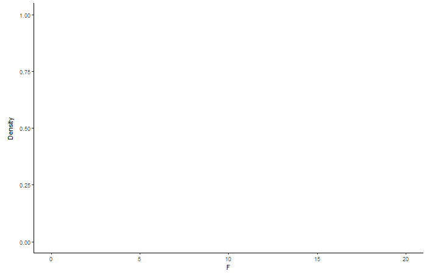

# Power and Sample Size

```{r echo = F, warning = F, message = F}
library(ggplot2)
library(dplyr)
library(gganimate)
library(transformr)
```

```{r echo = F, warning = F}
colorize <- function(x, color) {
  if (knitr::is_latex_output()) {
    sprintf("\\textcolor{%s}{%s}", color, x)
  } else if (knitr::is_html_output()) {
    sprintf("<span style='color: %s;'>%s</span>", color, 
      x)
  } else x
}
```

The F-statistic we obtained from our `insectSprays` example was so large that we assumed it was a statistically significant result. Of course in practice we would conduct a formal hypothesis test and invoke a null F-distribution to test statistical significance. For our **effects** model we put together for `insectSprays` we would pose the following null and alternative hypotheses:

- $H_{0}$: The type of spray **has no effect** on insect count in the population of all insect plots.
- $H_{a}$: The type of spray **has an effect** on insect count in the population of all insect plots.

We can plot the null **F(5, 66)** distribution in R:

```{r}
insects_F <- ggplot(NULL, aes(x = c(0, 35))) +
  stat_function(fun = df, geom = "area", fill = "steelblue",
    args = list(df1 = 5, df2 = 66), alpha = 0.6) + 
  theme_classic() + 
  xlab("F") + 
  ylab("Density") + 
  stat_function(fun = df, args = list(df1 = 5, df2 = 66),
    geom = "area",
    fill = "steelblue",
    xlim = c(qf(p = 0.99, df1 = 5, df2 = 66), 35)
  ) + 
  geom_vline(xintercept = qf(p = 0.99, df1 = 5, df2 = 66), color = "red") + 
  geom_vline(xintercept = 34.7, linetype = "dashed")

```

```{r insects-F-stat, fig.cap='Null F-distribution with a numerator df = 5 and denominator df = 66. The dark blue shaded area demarcated by the solid red line represents the the critical F-statistic value at which to reject our null hypotheis at the 0.01 significance level. Our obtained F-statistic (black dashed line) clearly exceeds this threshold!', echo = F}
insects_F
```

**F(5, 66) = 34.7 with p-value <0.0001**

I'd say we were pretty safe to assume what what we did in Part \@ref(meanseffects) (essentially we rejected the null hypothesis posed above) just from glancing at the size of our computed F-statistic.

Our `insectSprays` example lended itself pretty darn well to getting a statistically significant F-statistic. A worthwhile question to ask if we were setting up our own experimental design outside of this example would be:

_**How can we design our experiment to increase our chances of getting a statistically significant F-statistic?**_

## Power

The answer to the above question can be answered by thinking about **power**. Power is the probability that we reject our null hypothesis when in fact the null hypothesis is actually false [@oehlert2010]. To make sense of this recall the Type I error and Type II error rates from introductory statistics:

- Type I Error Rate: Probability that we reject our null hypothesis when it is in fact the null is true
- Type II Error Rate: Probabilility that we fail to reject the null hypothesis when in fact the null is false

Power represents the probability of the "correct" decision between these two errors rates. To determine power in the context of 1-way ANOVA we can plot both the central (null) and non-central F-distributions. The central F-distribution (an example is \@ref(fig:insects-F-stat)) shows the distribution of F-statistics when our null hypothesis is actually true. On the other hand, the non-central F-distribution shows the distribution of F-statistics when the the null hypothesis is actually false. The shape of the non-central F-distribution is dictated by a non-centrality parameter, viz., 

$$NCP = \frac{\sum n_{i}\tau_{i}^2}{\sigma^2}$$

We can estimate $\tau_{i}^2$ as the effect of the $ith$ treatment group, $n_{i}$ as the sample size (replicates) per treatment group, and $\sigma^2$ as mean square error (MSE). To illustrate how the central and non-central F-distributions are used to determine power, let us look at a situation where we modify our beloved `insectSprays` example.

Suppose we wanted to determine power for an ANOVA F-test for a new insecticide study we were planning with the following assumptions:

- Our level of significance is $\alpha = 0.05$
- We will have three treatment groups (3 sprays) with 10 insect plots per treatment
- Our MSE will be 2 insects
- We assume the true mean change in insect count for the treatments will be $\mu_{1} = 4$, $\mu_{2} = 5$, and $\mu_{3} = 6$

We plot our central and non-central F-distributions to calculate power for the ANOVA F-test ($H_{0}$: $\mu_{1}$ = $\mu_{2}$ = $\mu_{3}$). To plot the latter distribution we need to compute our non-centrality parameter:

```{r}
group_means <- c(4, 5, 6)
grand_mean <- mean(group_means)
ncp_1 <- 10 * ((group_means[1] - grand_mean)^2 + (group_means[2] - grand_mean)^2 + (group_means[3] - grand_mean)^2)/2
ncp_1
```

Plotting our distributions:

```{r power_distr }
example_power_fdists <- ggplot(NULL, aes(x = c(0, 15))) +
  
  # Null F-distribution F(2, 27, 0)
  stat_function(fun = df, geom = "area", fill = "steelblue",
    args = list(df1 = 2, df2 = 27, ncp = 0), alpha = 0.8) +
  
  # Non-central F-distribution F (2, 27, 10)
  stat_function(fun = df, geom = "area", fill = "yellow",
    args = list(df1 = 2, df2 = 27, ncp = ncp_1), alpha = 0.5) +
  
  # Power
  stat_function(fun = df, args = list(df1 = 2, df2 = 27, ncp = ncp_1),
    geom = "area", fill = "green", alpha = 0.5,
    xlim = c(qf(p = pf(qf(0.95, 2, 27), 2, 27, ncp = ncp_1, lower.tail = F), 
                df1 = 2, df2 = 27, ncp = ncp_1, lower.tail = FALSE), 20)) +
  
  # F-critical value (alpha = 0.05)
  geom_vline(xintercept = qf(p = 0.95, df1 = 2, df2 = 27), color = "red", linetype = "dashed") +
  theme_classic() + 
  ylab("Density") + 
  xlab("F")

```

```{r ex-power-fdists, fig.cap='Plotted F (2, 27, 0) and F(2, 27, 10) distributions (represented by the blue and yellow/green shadings respectively). The power of our ANOVA F-test is the shaded green area of the non-central F-distribution to the right of the red-dashed line.', echo = F}
example_power_fdists
```

Our power is the `r colorize("green", "green")` shaded area, the density of upper tail of the non-central F (2, 27, 10) past the critical F-statistic corresponding to our chosen level of significance. We can calculate this formally in R:

```{r}
pf(qf(0.95, 2, 27), 2, 27, ncp = ncp_1, lower.tail = FALSE)
```

## Playing with Sample Size

The non-centrality parameter is ultimately what controls the power of our statistical test. The larger the non-centrality parameter, the larger the power. We can deduce from the non-centrality parameter formula that we can change it by:

1. Changing the sample size in our experimental design
2. Changing our treatment group effect sizes
3. Changing our MSE (within treatment group variance)

In practice, changing sample size is probably the easiest way to tweak power. The below animation illustrates how the non-centrality parameter and power change with different sample sizes if we keep everything else the same as specified in our above example for calculating power.

```{r include = FALSE, echo = FALSE}
ncp_2 <- 5 * ((group_means[1] - grand_mean)^2 + (group_means[2] - grand_mean)^2 + (group_means[3] - grand_mean)^2)/2
ncp_3 <- 15 * ((group_means[1] - grand_mean)^2 + (group_means[2] - grand_mean)^2 + (group_means[3] - grand_mean)^2)/2
```

```{r include = F}
# Ugly but it works lol

sample_size_animation <- ggplot(NULL, aes(x = c(0, 15))) +
  theme_classic() + 
  ylab("Density") + 
  xlab("F") + 
  stat_function(fun = df, geom = "area", fill = "steelblue",
    args = list(df1 = 2, df2 = 12, ncp = 0), alpha = 0.8) +
  
  # Non-central F-distribution F (2, 12, 10)
  stat_function(fun = df, geom = "area", fill = "yellow",
    args = list(df1 = 2, df2 = 12, ncp = ncp_2), alpha = 0.5) +
  
  # Power
  stat_function(fun = df, args = list(df1 = 2, df2 = 12, ncp = ncp_2),
    geom = "area", fill = "green",
    xlim = c(qf(p = pf(qf(0.95, 2, 12), 2, 12, ncp = ncp_2, lower.tail = F), 
                df1 = 2, df2 = 12, ncp = ncp_2, lower.tail = FALSE), 20)) +
  
  # F-critical value for frame 1 (alpha = 0.05)
  geom_vline(xintercept = qf(p = 0.95, df1 = 2, df2 = 12), color = "red", linetype = "dashed") + 
  
  transition_layers(layer_length = 1, transition_length = 2) + 
  
  ### Frame 2 (sample size per group = 10)
  # Null F-distribution F(2, 27, 0)
  stat_function(fun = df, geom = "area", fill = "steelblue",
    args = list(df1 = 2, df2 = 27, ncp = 0), alpha = 0.8) +
  
  # Non-central F-distribution F (2, 27, 10)
  stat_function(fun = df, geom = "area", fill = "yellow",
    args = list(df1 = 2, df2 = 27, ncp = ncp_1), alpha = 0.5) +
  
  # Power
  stat_function(fun = df, args = list(df1 = 2, df2 = 27, ncp = ncp_1),
    geom = "area", fill = "forestgreen",
    xlim = c(qf(p = pf(qf(0.95, 2, 27), 2, 27, ncp = ncp_1, lower.tail = F), 
                df1 = 2, df2 = 27, ncp = ncp_1, lower.tail = FALSE), 20)) +
  
  # F-critical value for frame 2 (alpha = 0.05)
  geom_vline(xintercept = qf(p = 0.95, df1 = 2, df2 = 27), color = "red", linetype = "dashed") + 
  
  transition_layers(layer_length = 1, transition_length = 2) + 
  
    ### Frame 3 (sample size per group = 15)
  # Null F-distribution F(2, 42, 0)
  stat_function(fun = df, geom = "area", fill = "steelblue",
    args = list(df1 = 2, df2 = 42, ncp = 0), alpha = 0.8) +
  
  # Non-central F-distribution F (2, 42, 15)
  stat_function(fun = df, geom = "area", fill = "yellow",
    args = list(df1 = 2, df2 = 42, ncp = ncp_3), alpha = 0.5) +
  
  # Power
  stat_function(fun = df, args = list(df1 = 2, df2 = 42, ncp = ncp_3),
    geom = "area", fill = "darkgreen",
    xlim = c(qf(p = pf(qf(0.95, 2, 42), 2, 42, ncp = ncp_3, lower.tail = F), 
                df1 = 2, df2 = 42, ncp = ncp_3, lower.tail = FALSE), 20)) +
  
  # F-critical value for frame 2 (alpha = 0.05)
  geom_vline(xintercept = qf(p = 0.95, df1 = 2, df2 = 42), color = "red", linetype = "dashed") +
  
  transition_layers(layer_length = 1, transition_length = 2)

anim_save("power_animation.gif", animation = sample_size_animation)  
```

```{r flowchart, fig.cap='Animation showing the change in power with increasing sample size. The different shades of green represent the changing amounts of power.', echo = F}

```

The graphic adds respective F-distributions and probabilites in order of increasing sample size. The first set of layers correspond to a sample size of 5 replicates per treatment (15 total plots), the next set correspond to 10 per treatment (30 total plots), and the last set correspond to 15 per treatment (45 total plots). Pay attention to the green shaded areas in the graphic, this represents the power in each of our three scenarios with different sample size. The yellow shaded area (non-central F-distribution) widens with increasing sample size leading to higher power!